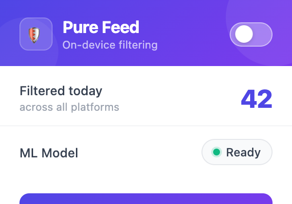
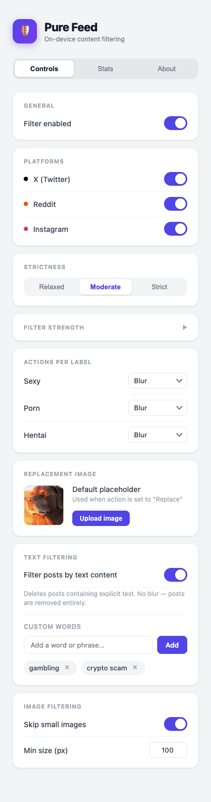
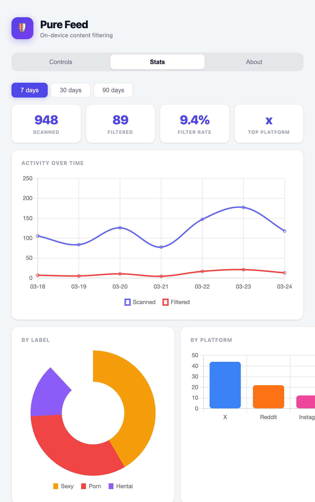
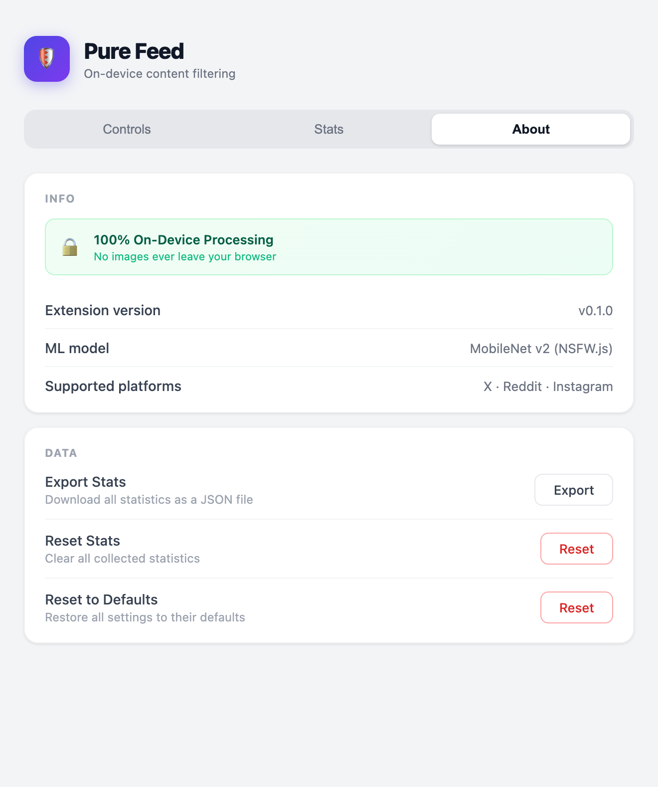

# Pure Feed

**On-device NSFW filtering for social media feeds.** Pure Feed uses machine learning entirely inside your browser — no images, no data, and no requests ever leave your device.

Supported platforms: **X (Twitter)** · **Reddit** · **Instagram**

---

## Screenshots

<table>
  <tr>
    <td align="center"><b>Popup</b></td>
    <td align="center"><b>Controls</b></td>
    <td align="center"><b>Stats</b></td>
    <td align="center"><b>About</b></td>
  </tr>
  <tr>
    <td valign="top"></td>
    <td valign="top"></td>
    <td valign="top"></td>
    <td valign="top"></td>
  </tr>
</table>

---

## Install

### 1. Download

Go to the [Releases page](../../releases/latest) and download `pure-feed-v*.zip`.

### 2. Extract

Unzip the downloaded file to get a folder with the extension files.

### 3. Load in Chrome

1. Open `chrome://extensions`
2. Enable **Developer mode** (toggle in the top right)
3. Click **Load unpacked** and select the extracted folder

### 4. Pin the extension

Click the puzzle piece icon in Chrome's toolbar and pin **Pure Feed** for quick access.

### 5. Enable in Incognito (optional)

Pure Feed is not active in Incognito by default. To enable it:

1. Open `chrome://extensions`
2. Click **Details** on the Pure Feed card
3. Toggle **Allow in Incognito**

---

## Usage

**Click the extension icon** to open the popup:
- Toggle filtering on/off instantly
- See how many images were filtered today across all platforms
- Check ML model status (green = ready, amber = loading)
- Open the full settings page

**Click "Open Settings →"** to access the options page:

| Tab | What you can configure |
|-----|------------------------|
| **Controls** | Per-platform toggles · Strictness preset · Per-label actions · Custom replacement image · Text filtering toggle · Min image size |
| **Stats** | Images scanned/filtered over the last 7, 30, or 90 days — by label and by platform |
| **About** | Version info · Data export · Settings reset |

---

## How it works

Pure Feed uses [NSFW.js](https://github.com/infinitered/nsfwjs) (MobileNet v2) running entirely in your browser via TensorFlow.js.

1. **Detect** — A `MutationObserver` watches your feed for new images and text as you scroll
2. **Pre-hide** — Images are hidden immediately to prevent NSFW content flashing on screen
3. **Classify** — Each image is sent to an offscreen document running TensorFlow.js, which returns confidence scores across 5 labels: `Neutral`, `Drawing`, `Sexy`, `Porn`, `Hentai`. Text is scanned locally via keyword matching.
4. **Act** — Images that exceed your configured thresholds get the action you chose; posts with NSFW text are deleted; clean content is revealed normally
5. **Cache** — Image results are cached by URL so each image is only classified once per session

> All processing is on-device. No image data is sent to any server.

---

## Configuration

### Strictness presets

| Preset | Description |
|--------|-------------|
| **Relaxed** | Only catches high-confidence NSFW content |
| **Moderate** | Balanced defaults (recommended) |
| **Strict** | Lower thresholds — catches borderline content |

You can also open **Advanced Thresholds** to set per-label confidence values (0.0–1.0) manually.

### Actions per label

For each label (`Sexy`, `Porn`, `Hentai`) you can choose independently:

| Action | What happens |
|--------|-------------|
| **Blur** | Applies a 24px blur; click the image to temporarily reveal it |
| **Hide** | Collapses the image element — the post remains but the media is gone |
| **Replace** | Swaps the image with your configured replacement (default: a placeholder) |
| **Delete post** | Removes the entire post from the DOM — it's gone until you reload the page |

### Text filtering

When enabled, Pure Feed scans post text for NSFW keywords and deletes matching posts from the feed. This uses fast keyword/regex matching (no ML model needed) and catches explicit terms across the same categories used for images (Sexy, Porn, Hentai). Text filtering is off by default — enable it in the Controls tab under **Text Filtering**.

### Custom replacement image

When any label is set to **Replace**, you can upload your own image in the Controls tab under **Replacement Image**. The image is compressed and stored locally in your browser — it persists across sessions and never leaves your device.

---

## Development

Requires Node.js. First-time setup:

```bash
cd extension
npm run setup
```

After making changes:

```bash
cd extension
npm run build
```

Then reload the extension in `chrome://extensions`.

To package a release zip:

```bash
cd extension
npm run package
```

The options page also has a live dev server with hot-reload and a full Chrome API mock (no extension context required):

```bash
cd extension/options
npm run dev
# → http://localhost:5173
```

---

## Tech stack

| Layer | Technology |
|-------|------------|
| Extension | Chrome Manifest V3 |
| ML | TensorFlow.js + NSFW.js (MobileNet v2, ~25 MB) |
| Content scripts | Vanilla JS + MutationObserver |
| Options page | React 19 + Vite 6 |
| Charts | Chart.js + react-chartjs-2 |
| Build | esbuild (content/offscreen bundles) |

---

## Privacy

- **Zero data collection** — no analytics, no telemetry, no remote requests
- **On-device ML** — the model ships with the extension and runs locally via WebGL or WASM
- **No image uploads** — pixels are classified inside an offscreen canvas; they never leave your browser
- **Local storage only** — settings, stats, and any custom replacement image are stored in `chrome.storage.local`
